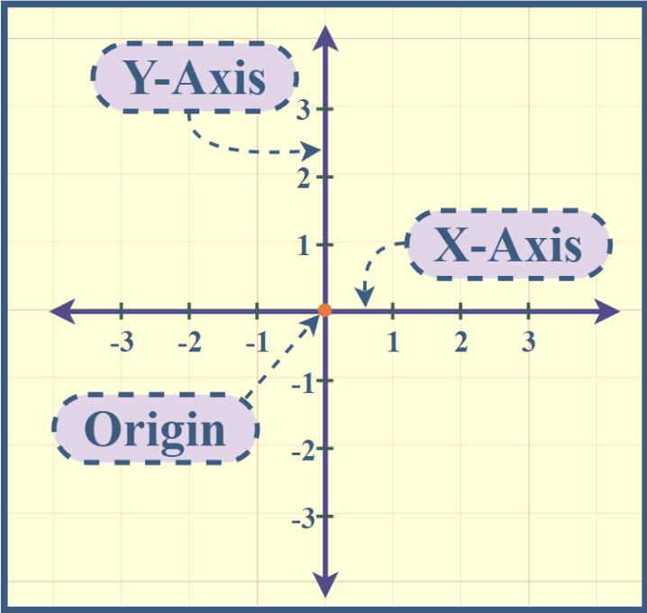
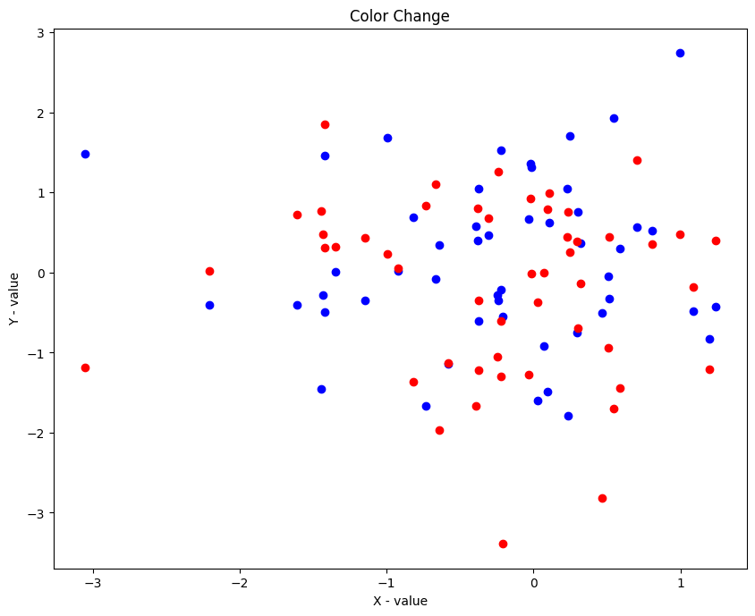
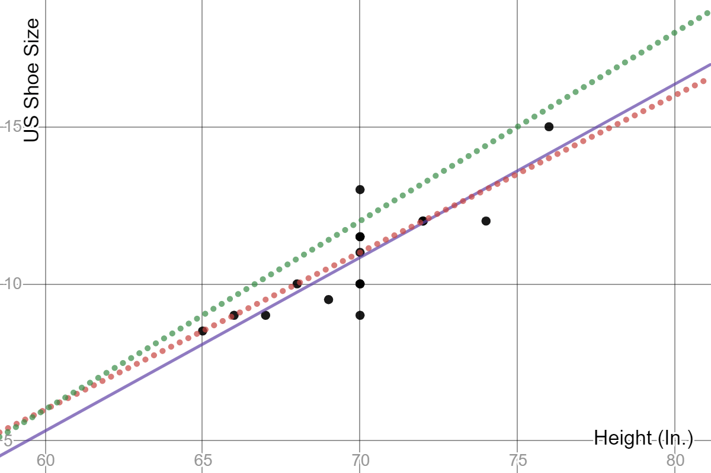

# Types of Plots/Charts

Before diving into types of plots, let's cover the basics:

- **X-axis (Horizontal)**: Represents one variable or column.
- **Y-axis (Vertical):** Represents another variable or column.
- **Origin**: The point where both axes meet.
- **Tick Marks**: Units of measurement for each variable/column, marked on the axes.
- **Coordinates**: Points on the plot defined by their x and y values.

---

## Types of Plots/Charts
1. ### Scatter Plot:
    - Both x and y variables are numerical.
    - Points represent data, and lines may connect points to show trends.
- 
2. ### Line Plot/Trend Plot:
    - Shows trends over time or across categories.
    - Lines connect points to illustrate patterns or relationships.
- 

3. ### Bar Chart/Plot:
    - **Use for**: Comparing categorical data across different groups.
    - **Key concept**: Useful for showing discrete data comparisons.
- 

4. ### Box Plot:
    - **Use for**: Visualizing distribution and identifying outliers in data.
    - **Key concept:** Displays median, quartiles, and outliers.
  

5. ### Pie Chart
    - **Use for**: Showing how different categories contribute to a whole.
    - **Key concept**: Best for displaying a small number of categories.

6. ### Area Chart:
    - **Use for**: Displaying cumulative totals over time or categories.
    - **Key concept**: Similar to line charts but filled with color.

7. ### Spider Plot (Radar Chart):
    - **Use for**: Comparing multiple categories across different groups.
    - **Key concept**: Useful for multivariate data comparison.

8. ### Tree Map:
    - **Use for**: Displaying hierarchical data and part-to-whole relationships.
    - **Key concept**: Uses nested rectangles to represent data.

9.  ### Time Series Plots:
    - Use for: Showing trends over time.
    - Key concept: Essential for analyzing temporal data patterns.
  

Each plot type serves a specific purpose, and choosing the right one depends on the data and the story you want to tell.These plots help visualize relationships between variables and identify trends in data.

