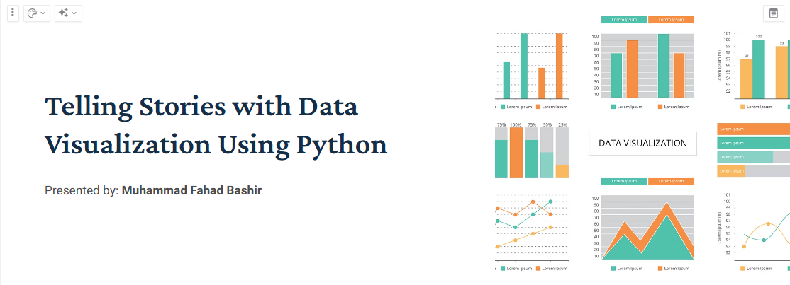

## Workshop: Telling Stories with Data Visualization Using Python
### By [Muhammad Fahad Bashir](https://www.linkedin.com/in/mfahadbashir/)
📅 Date: [17-05-2025]  
📍 Venue: Zoom Online

---
### Refrence Notes 
* [Recording Link ](https://zoom.us/rec/share/1234567890)*
* [Slides Link](./slides%20Telling-Stories-with-Data-Visualization-Using-Python.pptx)
* [Types of Basic Plots](./00_1.%20Types%20of%20plots%20&%20charts.pdf)
* [Workshop 01 Basic (Example with pandas,matplotlib & Seaborn)](./workshop_01_basic.ipynb)
* [Workshop 02 Plotly Plot in Detail](./workshop_02_plotly.ipynb)

---

### 🗂️ Workshop Overview
* Popular Python Libraries with examples 
* comparing libraries with each other 
* Hands-on with 17+ Charts:
   * - Bar, Line, Pie, Scatter, Histogram...
   * - Heatmap, Sunburst, Geomap, Animation
* Q&A / Live Demos

---

